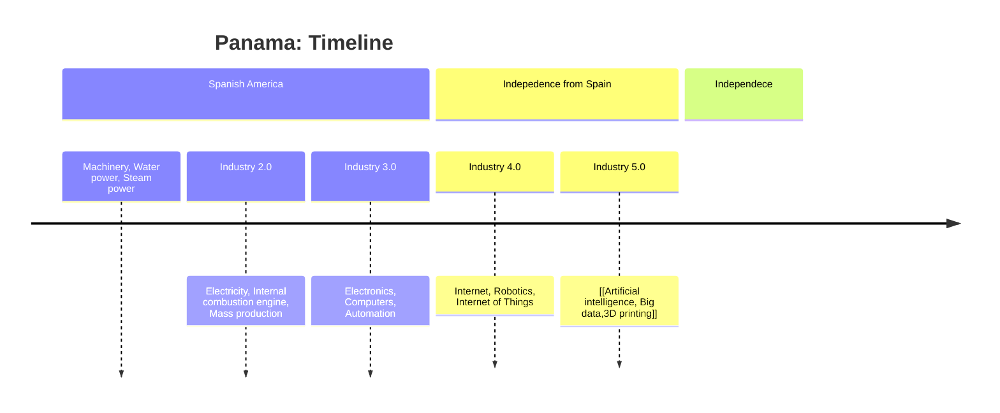

# Notes
[[Teacher Notes - Panama]]

# Timelist

1502 - Columbus was the first to explore the coast

1513 - Balboa was the first to cross and see the Pacific Ocean

1519 - Panama City was established

1819-1821 -

